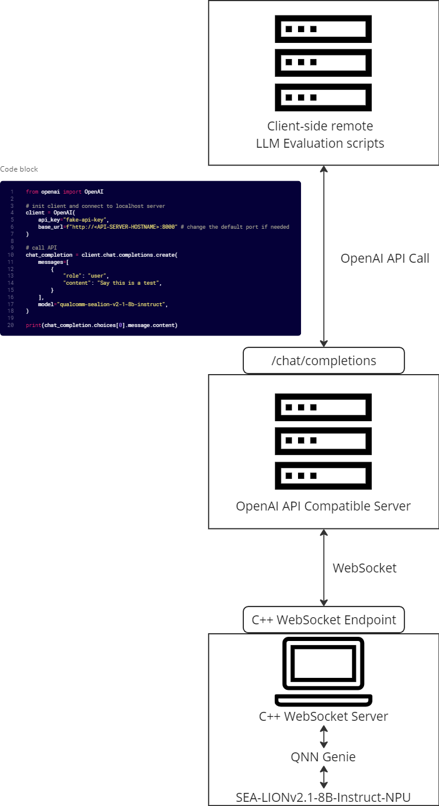

# cnasg-aipc-openai-api
OpenAI API Compatible server adapted for Dell AI PCs running NPUs




# Getting Started

## Install Python dependencies
```
pip install uvicorn fastapi openai
```

## Serve OpenAI API Compatible Server
```
uvicorn server:app
```

## Run sample Client to test Server for `chat.completions` 
```
python client.py
```