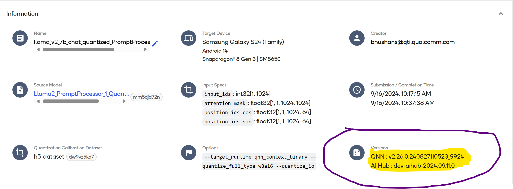
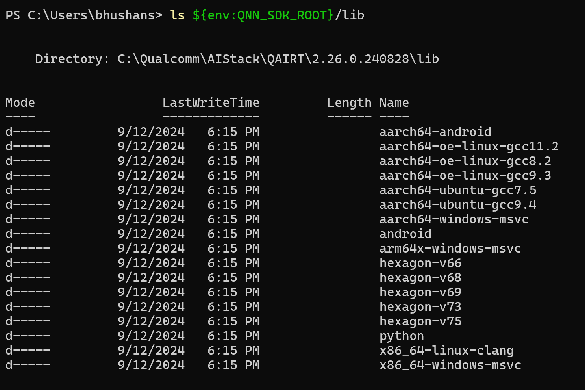
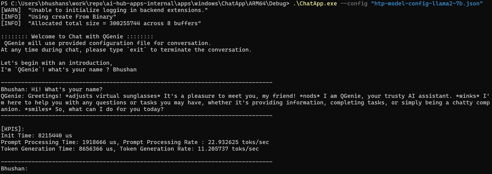

# CLI Chat application

Chat application for Windows on Snapdragon® with [Llama 2](https://aihub.qualcomm.com/compute/models/llama_v2_7b_chat_quantized) using Genie SDK.

The app demonstrates how to use the Genie APIs from [QNN SDK](https://qpm.qualcomm.com/#/main/tools/details/qualcomm_ai_engine_direct) to run and accelerate LLMs using the Snapdragon® Neural Processing Unit (NPU).

## Requirements

### Platform

- Snapdragon® Platform (e.g. X Elite)
- Windows 11+

### Tools and SDK

- Visual Studio 22
  - Download any variant of [Visual Studio here](https://visualstudio.microsoft.com/vs/)
  - Make sure Desktop development with C++ tools are selected during installation or installed separately later
- QNN SDK: [Qualcomm AI Engine Direct](https://qpm.qualcomm.com/#/main/tools/details/qualcomm_ai_engine_direct)
  - Refer to [Setup QNN SDK](#setup-qnn-sdk) to install compatible QNN SDK for models downloaded from AI Hub.

## Build App

### Compile to QNN Binary via AI Hub and Generate Genie Bundle

1. Copy `ChatApp` to target device (e.g., Snapdragon® based Windows)

2. Please follow [this
tutorial](https://github.com/qcom-ai-hub/ai-hub-apps-internal/tree/main/tutorials/llm_on_genie)
to generate `genie_bundle` required by ChatApp

3. Copy bundle assets from step 2 to `ChatApp\genie_bundle`. You should see
`ChatApp\genie_bundle\*.bin` QNN binary files.


### Setup QNN SDK

Please ensure that the QNN SDK version installed on the system is the same as the one used by AI Hub for generating QNN context binaries.
You can find the AI Hub QNN version in the compile job page as shown in the following screenshot:



Having different QNN versions could result in runtime or load-time failures.

Please follow the following steps to configure QNN SDKs for ChatApp:

1. Download and install [Qualcomm AI Engine Direct](https://qpm.qualcomm.com/#/main/tools/details/qualcomm_ai_engine_direct)
2. Set global environment variable `QNN_SDK_ROOT` to root path of QNN SDK e.g. `C:\Qualcomm\AIStack\QAIRT\2.26.0.240828`

    - Make sure you can run the following command with no error and that it prints the various libraries available with your QNN package:

    ```powershell
    ls ${env:QNN_SDK_ROOT}/lib
    ```

    
3. If command from step 2 succeeds, QNN SDK is correctly configured to work with ChatApp.


### Build project in Visual Studio 22

Make sure `QNN_SDK_ROOT` is set globally pointing to QNN SDK before you build the project.

1. Open `ChatApp.sln`
2. Build project in Visual Studio

## Running App

### Providing local paths

### Running via Visual Studio

Click on the green play button to build and run.

Visual studio project is configured with the following command arguments:

```powershell
.\ARM64\Debug\ChatApp.exe --genie-config .\\genie_bundle\\genie_config.json --base-dir .\\genie_bundle\\
```

### Running app via CLI

```powershell
cd {Project directory}
.\ARM64\Debug\ChatApp.exe --genie-config .\\genie_bundle\\genie_config.json --base-dir .\\genie_bundle\\
```

Run `--help` to learn more:

```powershell
.\ARM64\Debug\ChatApp.exe --help
```

Make sure to provide paths to local config file and models using `\\` or `/` as a path separator and not `\`


#### Correct file path examples

```powershell
1. C:\\Path\\To\\Model\\Config\\llama2_7b.json
2. C:/Path/To/Model/Config/llama2_7b.json
```

#### Incorrect file path example

```powershell
1. C:\Path\To\Model\Config\llama2_7b.json
```


### Sample Output


